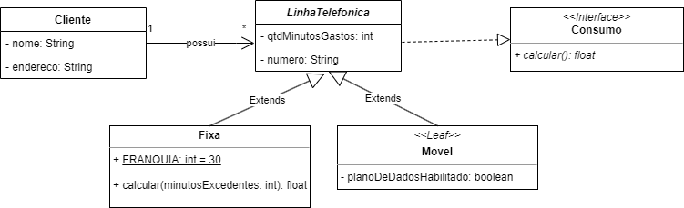

# Teste de Performance 3

Uma empresa de telefonia comercializa dois tipos de Linhas Telefonicas. Na linha Fixa, o cliente paga um valor de assinatura (RS 45,00) que dá direito a 30 minutos por mês (FRANQUIA). Nessa modalidade, o cliente paga o valor da assinatura mesmo que use menos de 30 minutos. Usando mais de 30 minutos, o cliente paga RS 0,05 por minuto excedente. No linha móvel, o cliente não paga assinatura, pois somente são cobrados os minutos efetivamente utilizados. Nessa modalidade, entretanto, os minutos são mais caros: RS 0,20 por minuto. Se o plano de dados estiver habilitado, acrescenta-se mais RS 40,00 de custo. O diagrama de classes acima modela parcialmente o software da empresa. Faça o programa em Java que contemple às questões de 1 a 11:

* Implemente a interface Consumo.
* Observando que a classe LinhaTelefonica é abstrata, implemente-a em Java, encapsulando todos os atributos. Crie o construtor parametrizado.
* Crie as demais classes do sistema com o construtor parametrizado. Observe que a classe Movel é final.
* Encapsule os atributos quando for conveniente. É obrigatório fazer uma lógica de validação do atributo qtdMinutosGastos.
* O método calcular() é abstrato na superclasse, e suas implementações nas classes filhas devem usar polimorfismo e devem estar de acordo com as regras de negócio descritas no texto explicativo.
* Na classe Fixa, o método calcular(minutosExcedentes) retorna o valor da conta sem considerar o valor padrão da assinatura.
* Na classe LinhaTelefonica, crie um atributo que permita associar um cliente.
* Na classe Cliente, crie um atributo que permita associar linhas telefônicas. Crie um método para adicionar uma nova linha telefônica.
* Crie uma classe de teste chamada “Principal”, na qual sejam instanciadas 04 linhas (2 de cada tipo) e 02 clientes.
* Faça a leitura dos dados a partir do teclado.
* Imprima os objetos lembrando-se da sobrescrição do método toString() nas classes.